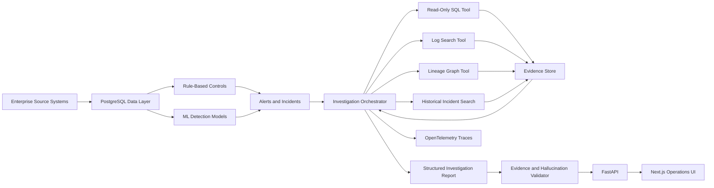

# LineageIQ

**Evidence-grounded root-cause investigation for enterprise data incidents.**

LineageIQ combines deterministic data-quality controls, machine-learning models,
dependency-graph reasoning, read-only enterprise tools, and an evidence-grounded AI investigation
agent to diagnose failures across a synthetic multi-system company.

> **This is a production-style portfolio system, not a production-ready product.** The company
> (**AtlasCommerce**) and all datasets are **fully synthetic**. LineageIQ has not resolved any
> real company incidents. Evaluation numbers in this README are generated by the evaluation
> runner \ none are hand-written.

## Business problem

When a financial report, customer metric, payment total, refund calculation, or operational
dashboard becomes incorrect, finding the root cause means correlating many systems: orders,
payments, refunds, FX rates, pipelines, logs, and lineage. LineageIQ automates the investigation:
it detects the anomaly, gathers evidence with safe read-only tools, reasons over data lineage,
retrieves similar historical incidents, ranks likely root causes with citations, and escalates to
a human when the evidence is insufficient.

## Architecture



## Technology stack

- **Backend / data:** Python 3.12, FastAPI, SQLAlchemy 2, Alembic, Pydantic 2, pandas, NumPy,
  scikit-learn, XGBoost, NetworkX, sqlglot, PostgreSQL.
- **Frontend:** Next.js, TypeScript, React, React Flow (lineage), Recharts (metrics).
- **Quality / infra:** Ruff, mypy, pytest, Docker, Docker Compose, GitHub Actions, OpenTelemetry,
  structured JSON logging, Makefile.
- **LLM:** provider-independent interface with a deterministic `FakeLLM` for tests/CI.

## Why both deterministic controls and ML?

Reconciliation problems (duplicate IDs, totals that don't add up, stale FX rates, missing
mappings) have **exact** answers — deterministic controls catch them precisely with zero false
positives, and they double as the automated baseline. ML (Isolation Forest, calibrated
classifiers, TF-IDF clustering) covers **fuzzier** signals: numeric anomalies, severity
prediction, incident-type classification, and grouping similar historical incidents. The agent
uses both as evidence and never relies on an LLM to validate another LLM.

## Local installation

Requires Docker (recommended) or Python 3.12 + Node 20.

```bash
cp .env.example .env

# Option A — full stack via Docker
docker compose up --build      # API :8000, frontend :3000, postgres :5432

# Option B — local (no Postgres needed; uses SQLite)
make install
make reset-db
make seed
make validate-data
make dev            # backend on :8000
make dev-frontend   # frontend on :3000
```

## Demo

```bash
make demo
```
Runs the deterministic **stale-FX-rate** scenario end to end (see `docs/DEMO_SCRIPT.md`).

## Documentation

- `docs/PLAN.md`, `docs/ARCHITECTURE.md`, `docs/DATA_MODEL.md`, `docs/AGENT_DESIGN.md`,
  `docs/EVALUATION.md`, `docs/SECURITY.md`, `docs/DEMO_SCRIPT.md`
- Architecture decisions: `docs/decisions/`
- Live task checklist: `TASKS.md`

## Evaluation methodology

Each incident is evaluated in isolation against a freshly restored clean baseline: inject → detect
→ investigate → validate → compare to ground truth. Metrics (root-cause top-1/top-3 accuracy,
classification F1, unsupported-diagnosis rate, escalation precision/recall, latency, token/cost,
calibration) are written to Postgres, JSON, CSV, and a Markdown report. See `docs/EVALUATION.md`.

**Generated results** (from `make evaluate`, 80 isolated incidents, deterministic FakeLLM — see
[`data/evaluation/latest_report.md`](data/evaluation/latest_report.md)):

| Metric | Value |
| --- | --- |
| Root-cause top-1 accuracy | 100.0% |
| Root-cause top-3 accuracy | 100.0% |
| Automated-baseline top-1 | 100.0% |
| Incident classification macro-F1 | 1.000 |
| Unsupported-diagnosis rate (report-level) | 0.0% |
| Escalation F1 | 60.0% |
| Mean diagnosis latency | 0.06s |
| Brier score / ECE | 0.020 / 0.14 |

These numbers reflect that the agent's diagnosis is grounded in **deterministic controls** whose
detector signals map cleanly to root causes — so top-1 accuracy is high by construction, and the
ML classifier (cross-validated, see `backend/app/ml/artifacts/metrics.json`) corroborates it. The
harder, more informative metrics are calibration and escalation routing. Numbers are regenerated by
the runner, never hand-written.

## Safety model

The agent can only touch data through registered **read-only** tools. The SQL tool is parsed with
`sqlglot`, restricted to single `SELECT`s with schema/table allowlists, row limits, and a
read-only DB role. Tool output is treated as untrusted data (prompt-injection defense). The agent
recommends remediation but never executes it. See `docs/SECURITY.md`.

## Limitations

- Synthetic data only; relationships are simplified vs. a real enterprise.
- Lineage uses NetworkX (Neo4j-ready interface), not a production graph DB.
- ML models are baseline-grade and trained on synthetic incidents.
- No manual-time improvement is claimed until real measurements are entered (see
  `data/evaluation/manual_benchmark_template.csv`).

## Future improvements

Neo4j-backed lineage, richer ML features, streaming detection, multi-incident (composite)
investigation, and a second-model grounding pass alongside the deterministic validator.

## Status

See `TASKS.md`. Phases 0–8 implemented (synthetic data, incident injection + detection, lineage,
ML, agent + tools, grounding/validation, full API + frontend, evaluation). Phase 9 (portfolio
polish) in progress.
