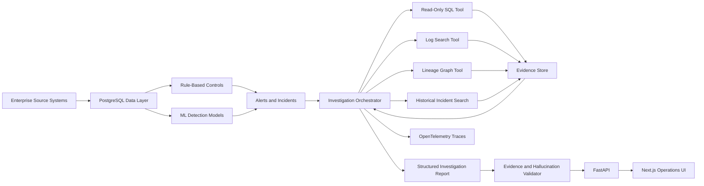

# LineageIQ — Architecture

## Overview

## Layers

### Data layer (`backend/app/models`, `db`, `simulator`)
SQLAlchemy 2 models for business tables (customers, orders, payments, refunds, fx_rates,
shipments, daily_revenue_report, ...) and operational tables (pipeline_runs, system_logs,
incidents, alerts, evidence, agent_runs, ground truth, historical incidents, evaluation runs).
The deterministic `simulator` builds a referentially consistent clean baseline.

### Incident layer (`backend/app/incidents`)
Ten injector classes, each producing a manifest (seed, changed records/tables, expected
symptoms, true root cause, expected evidence/remediation, escalation flag) and applying a
controlled mutation. Schema-change incidents are simulated via staging payloads + logs, never
DDL. A restore step regenerates the clean baseline for repeatable evaluation.

### Detection layer (`backend/app/detection`, `ml`)
Deterministic reconciliation controls produce standardized `Alert` objects. ML adds Isolation
Forest anomaly scoring, a calibrated classifier for incident type/severity, and TF-IDF +
clustering for historical-incident grouping. Deterministic rules are preferred where exact.

### Lineage layer (`backend/app/lineage`)
A `LineageStore` interface backed by NetworkX. Supports upstream/downstream traversal,
shortest path, and impact analysis. Graph defined in version-controlled config.

### Agent layer (`backend/app/agent`, `tools`)
A bounded orchestrator drives an LLM (via the provider-independent `LLMClient`) that may only
call registered read-only tools: `run_readonly_sql`, `search_logs`, `query_lineage`,
`search_historical_incidents`, `inspect_pipeline_runs`, `inspect_schema`. Every tool call is
traced, logged, validated, size-bounded, and produces an evidence record. The agent emits a
Pydantic `InvestigationReport`.

### Grounding/validation (`backend/app/agent/validation.py`)
A deterministic validator checks evidence-ID existence/ownership, evidence coverage vs.
confidence, taxonomy membership, no-remediation-claimed, and flags unsupported claims.

### API (`backend/app/api`)
Versioned FastAPI routes with typed request/response models, DI, centralized error handling,
correlation IDs, and structured JSON logging.

### Frontend (`frontend`)
Next.js + TypeScript: Operations overview, Incident queue, Incident detail (with evidence
cards + agent trace + lineage), Lineage explorer, Evaluation dashboard.

### Observability (`backend/app/observability`)
OpenTelemetry traces/spans for API requests, agent runs, tool calls, SQL, lineage, LLM, and
evaluation cases. Optional Jaeger via Docker Compose.

## Boundaries / safety
- Agent ⇄ tools is the only path to data; tools enforce read-only + allowlists + limits.
- Tool output is treated as untrusted data (prompt-injection defense).
- Money = Decimal; time = UTC.
